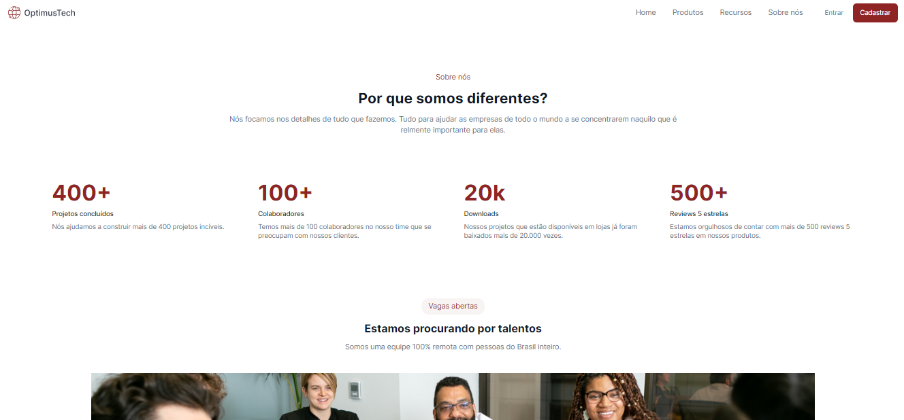

# HTML e CSS

O design do projeto foi construído no Figma e o desafio era reproduzir o layout desse código, utilizando as tecnologias HTML (linguagem de marcação) e CSS (linguagem de estilos).

## Visual do projeto

  

